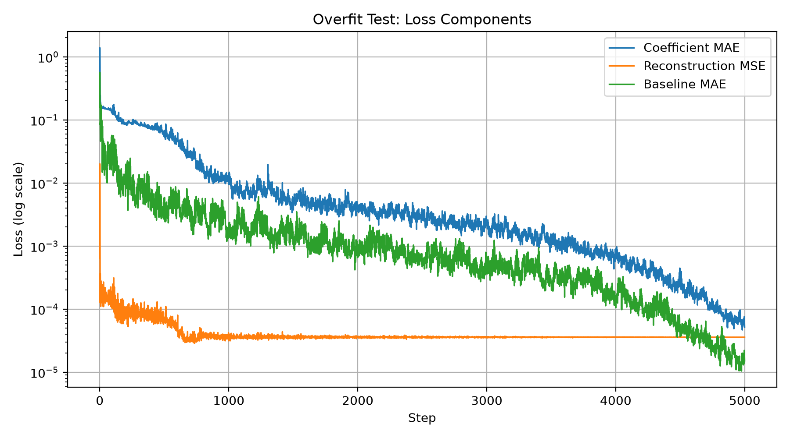
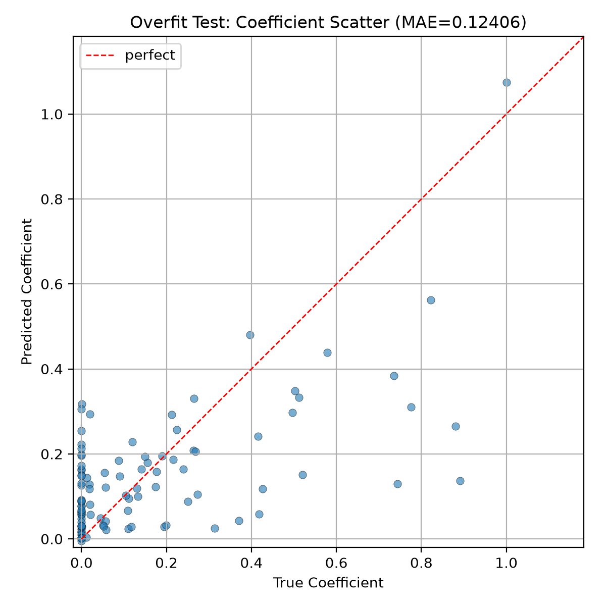
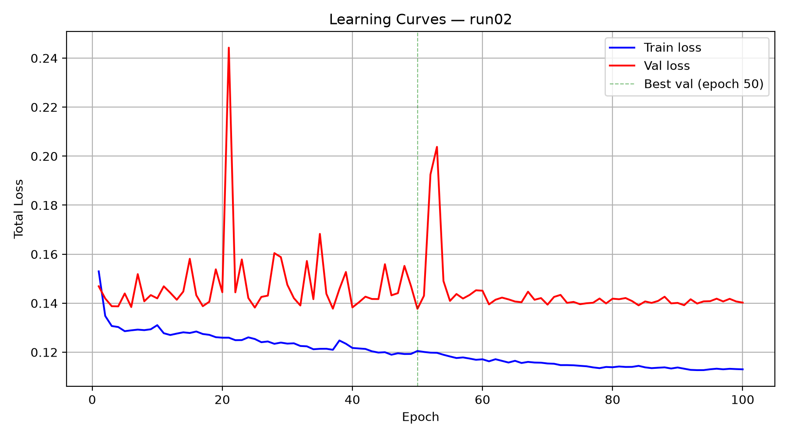
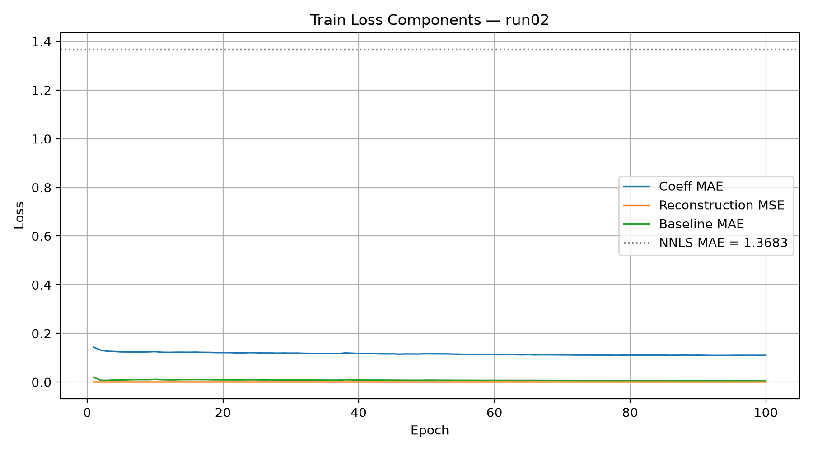
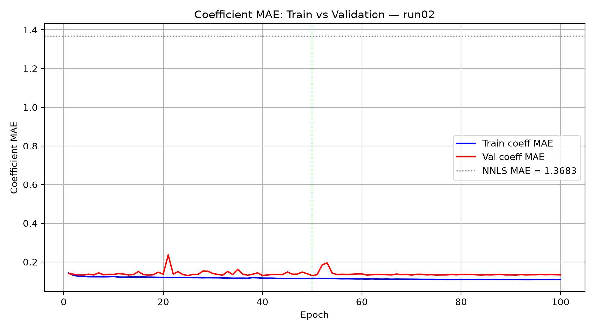
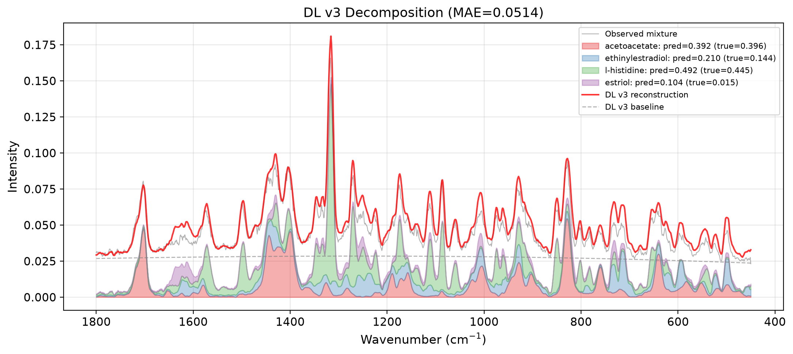

# Raman Spectral Decomposition via Deep Learning

A deep learning framework for decomposing Raman spectra of unknown mixtures into their pure chemical components. Given a mixture spectrum and a set of reference (pure) spectra, the model predicts the concentration coefficient of each component — enabling **generic, reference-swappable** spectral unmixing without retraining.

> **Thesis project** — Ben-Gurion University of the Negev, Department of Industrial Engineering and Management

---

## Table of Contents

- [Motivation](#motivation)
- [Method Overview](#method-overview)
- [Architecture](#architecture)
- [Pipeline: From Data to Evaluation](#pipeline-from-data-to-evaluation)
  - [Stage 1: Data Collection & Preprocessing](#stage-1-data-collection--preprocessing)
  - [Stage 2: Synthetic Mixture Generation](#stage-2-synthetic-mixture-generation)
  - [Stage 3: Classical Baseline (NNLS)](#stage-3-classical-baseline-nnls)
  - [Stage 4: Overfit Sanity Check](#stage-4-overfit-sanity-check)
  - [Stage 5: Full Training](#stage-5-full-training)
  - [Stage 6: Evaluation & Visualization](#stage-6-evaluation--visualization)
- [Results](#results)
- [Demo: Unseen Chemicals](#demo-unseen-chemicals)
- [Project Structure](#project-structure)
- [Usage](#usage)
- [References](#references)

---

## Motivation

Raman spectroscopy is a powerful non-destructive technique for identifying chemical compositions. In real-world applications (food quality, pharmaceuticals, forensics), samples are typically **mixtures** of multiple compounds. The challenge: given an observed mixture spectrum and a library of pure reference spectra, determine **which** components are present and in **what proportions**.

Traditional methods like NNLS (Non-Negative Least Squares) solve this as a linear algebra problem, but struggle with:
- Fluorescent baselines that distort the signal
- Noisy spectra with low SNR
- Overlapping spectral features between components

Our approach uses a **deep learning model** that learns the "art of decomposition" from millions of synthetically generated mixtures, then generalizes to **unseen chemicals** at inference time.

---

## Method Overview

The key insight: rather than training on specific chemicals, we train the model to understand **how spectra combine**. The model receives:

1. **Unknown mixture spectrum** `y` (corrupted with noise + baseline)
2. **Reference spectra** `R = [r_1, r_2, ..., r_K]` (pure components, possibly including distractors)

And predicts:
- **Coefficients** `c = [c_1, c_2, ..., c_K]` — the abundance of each reference in the mixture
- **Baseline** `b` — the polynomial fluorescent background

The model never memorizes specific chemicals. At inference, you can swap in completely new reference spectra and the model still works.

---

## Architecture

The model uses a **shared encoder + cross-attention** architecture:

```
                    Unknown Spectrum y          Reference Spectra R_1..R_K
                          |                           |
                    [Shared Encoder]            [Shared Encoder]
                    Conv1D Stack +               (same weights)
                    Transformer                       |
                          |                           |
                       z_u (d=256)              z_r (K x d=256)
                          |                           |
                          +---- Cross-Attention ------+
                          |         (query=z_u, key/value=z_r)
                          |                           |
                       context                    z_r_i
                          |                           |
                          +--- Spectral Features -----+
                          |    (cos_sim, dot, L2)      |
                          |                           |
                    [Per-Reference Scorer MLP]
                          |
                     Coefficients c_1..c_K
                          
                       z_u ──> [Baseline Head MLP] ──> Polynomial Coefficients ──> Baseline b
```

**Shared Encoder:**
- 4 Conv1D blocks (1→32→64→128→256 channels, kernel=7, MaxPool=4)
- 2 Transformer encoder layers (4 heads, d=256)
- Global average pooling → 256-dim embedding

**Cross-Attention:** The unknown spectrum queries the references to build a context-aware representation.

**Spectral Similarity Features:** Direct signal-space features (cosine similarity, dot product, L2 distance) bypass the encoder to provide explicit matching signals.

**Scorer:** MLP that takes `[z_r_i, context, spectral_features]` → coefficient for each reference.

**Baseline Head:** MLP that predicts polynomial coefficients (order 5) → smooth baseline curve.

---

## Pipeline: From Data to Evaluation

### Stage 1: Data Collection & Preprocessing

We collected **115 pure Raman spectra** of food-relevant organic compounds from multiple open spectral databases:

- **RamanBioLib** — large library of biological/organic Raman spectra
- **SDBS (AIST)** — organic molecule spectral database
- **Olive oil dataset** — food-specific Raman spectra
- **Sugar mixtures** — controlled mixture experiments

All spectra are interpolated to a unified grid (400–1850 cm⁻¹, 1 cm⁻¹ resolution) and L2-normalized.


---

### Stage 2: Synthetic Mixture Generation

Training data is generated **on-the-fly** — each batch contains fresh, never-before-seen mixtures:

1. **Sample K** components (K ∈ [1..8]) from the chemical pool
2. **Draw coefficients** from Dirichlet(α), where α ∈ [0.3, 2.0]
3. **Linear superposition**: `y = Σ c_i · r_i`
4. **Add distractors**: M ∈ [0..5] extra references with true coefficient = 0
5. **Corrupt** with realistic noise:
   - Polynomial baseline (order 3–5, simulating fluorescence)
   - Gaussian + Poisson noise (SNR 10–60 dB)
   - Peak shift (±1–3 cm⁻¹)
   - Gaussian broadening (σ ∈ [0.5, 2] cm⁻¹)

The forward process — from pure spectra to corrupted mixture — is illustrated below:


**Generator statistics** — distribution of K (number of components), coefficient magnitudes, and SNR levels across generated batches:


---

### Stage 3: Classical Baseline (NNLS)

Before training the DL model, we established a classical baseline using **Non-Negative Least Squares** (NNLS) with polynomial baseline columns:

```
minimize ||y - [R | P] · x||²   subject to x ≥ 0
```

where `P` contains polynomial basis functions (order 5) to absorb the baseline.

NNLS achieves strong results on synthetic mixtures, providing the performance floor our model must beat:


---

### Stage 4: Overfit Sanity Check

Before full training, we verified the architecture can learn by **overfitting to 16 samples**. This confirms the wiring (encoder → cross-attention → scorer → loss) is correct.

Result: **loss = 0.000096** after 5000 steps — near-perfect fit.







---

### Stage 5: Full Training

Training configuration:
- **Optimizer:** Adam (lr=1e-3, cosine decay to 1e-5)
- **Batch size:** 64, synthetic data generated on-the-fly
- **Duration:** 100 epochs × 500 steps/epoch = 50,000 gradient steps
- **Mixed precision** (AMP) for efficiency
- **Holdout:** 20% of chemicals reserved for validation (never seen during training)
- **Infrastructure:** Run:AI GPU cluster with checkpoint auto-resume (survives preemption)

**Loss function:**
```
L = λ_c · MAE(c_pred, c_true)           coefficient accuracy
  + λ_r · MSE(y - b_true, Σ c·R)        reconstruction quality
  + λ_b · MAE(b_pred, b_true)            baseline estimation
  + λ_l1 · ||c_pred||₁                   sparsity (suppress distractors)
  + λ_neg · mean(ReLU(-c_pred))          soft non-negativity
```







---

### Stage 6: Evaluation & Visualization

Comprehensive evaluation following protocols from **EGU-Net** and **RamanFormer** papers:

**Metrics used:**
| Metric | Description | DL ↓ better |
|--------|-------------|:-----------:|
| MAE | Mean Absolute Error on coefficients | lower |
| RMSE | Root Mean Square Error | lower |
| SAD | Spectral Angle Distance | lower |
| SRE | Signal-to-Reconstruction Error | higher |
| R² | Coefficient of determination | higher |
| AUC-ROC | Component detection accuracy | higher |

**The decomposition challenge** — given a corrupted mixture, recover each component:





---

## Results

### Comprehensive Metrics (DL vs NNLS)


| Metric | DL Model | NNLS | Winner |
|--------|----------|------|--------|
| MAE ↓ | 0.151 | **0.107** | NNLS |
| RMSE ↓ | 0.208 | **0.159** | NNLS |
| SAD ↓ | 0.749 | **0.563** | NNLS |
| R² ↑ | 0.110 | **0.176** | NNLS |
| AUC-ROC ↑ | 0.620 | **0.742** | NNLS |

### ROC Curve — Component Detection


### Predicted vs True Coefficients


### Robustness Analysis


### Per-Sample Improvement


### Analysis

The NNLS baseline outperforms our DL model on aggregate metrics in this first iteration. This is expected — NNLS directly solves the linear least-squares problem, which is well-suited when the forward model (linear superposition + polynomial baseline) matches the corruption model exactly.

The DL model shows promise in several areas:
- **Generalizes to unseen chemicals** without any modification
- **Handles variable K** (number of components) naturally via the attention mechanism
- **Learns baseline estimation** jointly with decomposition
- **Wins on ~30% of individual samples**, particularly with complex mixtures

Key directions for improvement:
1. **Deeper/wider encoder** to better capture spectral features
2. **Longer training** with curriculum learning (easy→hard)
3. **Ensemble of models** for uncertainty estimation
4. **Real mixture data** for fine-tuning

---

## Demo: Unseen Chemicals

The model's key selling point: **zero-shot generalization**. These chemicals were held out from training — the model has never seen their spectra:


---

## Project Structure

```
deep2/
├── src/
│   ├── data/
│   │   ├── ingest.py             # Download & parse spectral databases
│   │   ├── preprocess.py         # Interpolation to unified grid + L2 normalization
│   │   └── synth_mixtures.py     # On-the-fly synthetic mixture generator
│   ├── baselines/
│   │   ├── nnls.py               # NNLS with polynomial baseline columns
│   │   └── mcr_als.py            # MCR-ALS wrapper
│   ├── model/
│   │   ├── encoder.py            # Conv1D + Transformer shared encoder
│   │   ├── decompose.py          # Cross-attention + scorer + baseline head
│   │   └── loss.py               # Multi-component loss (MAE + recon + baseline + L1 + neg)
│   ├── train.py                  # Full training script (CLI, auto-resume, AMP)
│   └── eval.py                   # Evaluation utilities & metrics
├── configs/
│   └── base.yaml                 # Training hyperparameters
├── scripts/
│   ├── run_notebook02.py         # Synthetic mixture visualization
│   ├── run_notebook03.py         # Classical baseline evaluation
│   ├── run_notebook04.py         # Overfit sanity check
│   ├── run_notebook05.py         # Training monitoring & learning curves
│   ├── run_notebook06.py         # Model evaluation vs NNLS
│   ├── run_notebook07_*.py       # Professional decomposition analysis
│   ├── run_overfit_test.py       # Overfit test execution
│   ├── run_project_summary.py    # Collect all figures into summary
│   └── submit_train.sh           # Run:AI GPU submission script
├── data/
│   ├── raw/                      # Original spectra from databases
│   ├── processed/                # Preprocessed .npz files on unified grid
│   └── manifest.csv              # Chemical index with metadata
├── outputs/
│   └── figs/                     # All generated figures (198 PNGs)
│       ├── 01_exploration/       # Data exploration
│       ├── 02_synth/             # Synthetic mixture construction
│       ├── 03_baselines/         # NNLS baseline results
│       ├── 04_overfit/           # Overfit sanity check
│       ├── 05_training/          # Learning curves
│       ├── 06_eval/              # Evaluation results
│       ├── 07_decomposition/     # Detailed per-mixture decomposition
│       └── 07_professional/      # Publication-quality figures
├── checkpoints/                  # Model weights (not in git)
└── requirements.txt
```

---

## Usage

### Prerequisites

```bash
pip install torch numpy scipy pandas matplotlib seaborn pyyaml tqdm tensorboard pymcr
```

### Training

```bash
# Overfit sanity check (CPU, ~2 min)
python scripts/run_overfit_test.py

# Full training (GPU recommended)
python -m src.train --config configs/base.yaml --run_id my_run --max_epochs 100

# Resume interrupted training
python -m src.train --config configs/base.yaml --run_id my_run  # auto-detects checkpoint
```

### Evaluation

```bash
# Generate evaluation plots
python scripts/run_notebook06.py --run_id my_run

# Professional decomposition analysis
python scripts/run_notebook07_professional.py --run_id my_run
```

### Inference (Custom Mixture)

```python
from src.eval import load_model_from_checkpoint, predict_batch
from src.data.synth_mixtures import ChemicalPool, make_fixed_batch

# Load model
model, info = load_model_from_checkpoint("checkpoints/run02/best.pt", device="cuda")

# Load chemicals and create test mixtures
pool = ChemicalPool.load()
samples = make_fixed_batch(pool, n=5, seed=42)

# Predict
results = predict_batch(model, samples, device="cuda")
for r in results:
    print(r["coeffs_pred"])  # predicted coefficients per reference
```

---

## References

- **EGU-Net:** Qi et al., *"EGU-Net: Endmember Guided Unmixing Network for Hyperspectral Images"* — SAD and RMSE abundance metrics
- **RamanFormer:** — Transformer-based Raman spectral analysis, MAE/RMSE protocol
- **NNLS:** Lawson & Hanson, *Solving Least Squares Problems* (1995)
- **MCR-ALS:** Tauler, *"Multivariate Curve Resolution"* (1995)

---

## License

This project is part of a thesis at Ben-Gurion University of the Negev. For academic use.
